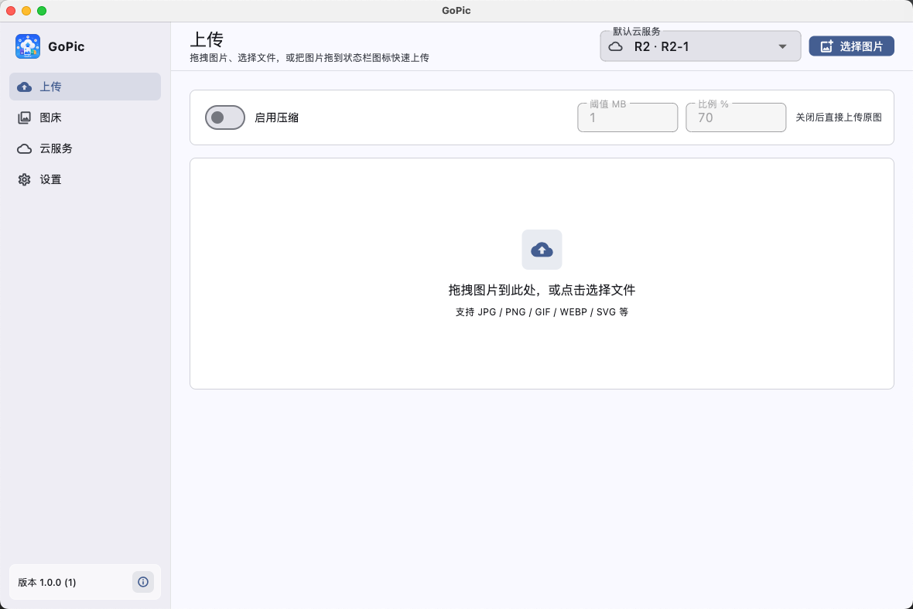
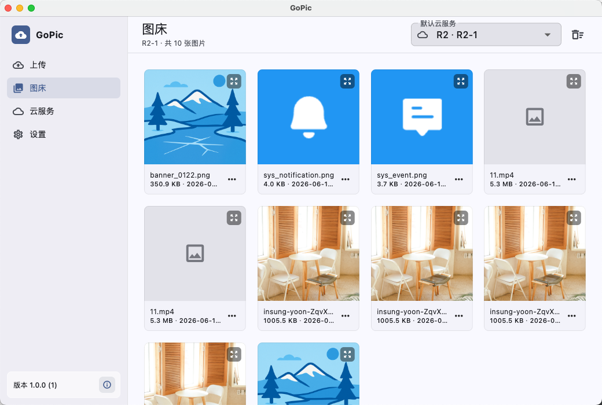
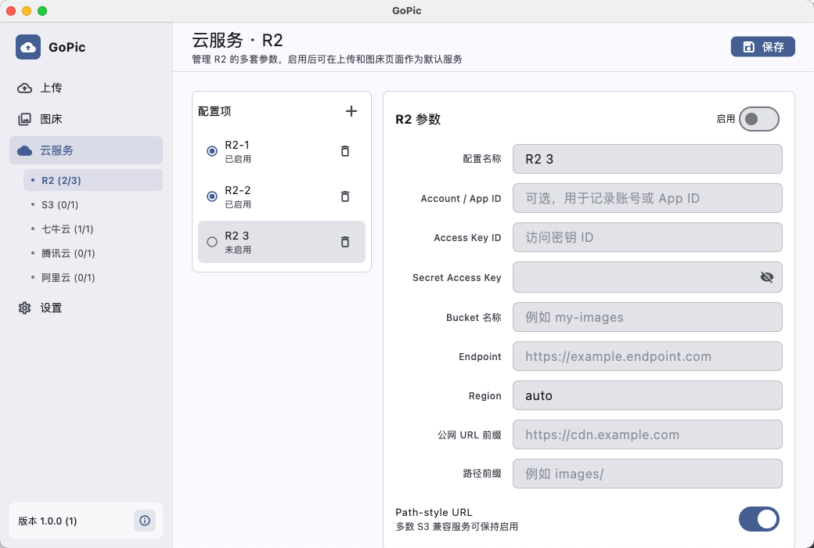

# GoPic

GoPic 是一款基于 Flutter 的桌面图床 / CDN 上传工具，面向 macOS 优先开发，灵感来自 [PicGo](https://github.com/Molunarfinn/PicGo)。当前版本聚焦图片快速上传、自动生成外链、本地上传历史和多云配置管理。

## preview





## 当前功能

- 图片上传：支持拖拽到主窗口、点击选择文件，也支持拖拽图片到 macOS 状态栏图标快速上传。
- 多云配置：可为每个云服务保存多套配置，并在上传页 / 图床页切换当前配置。
- 已接入上传：Cloudflare R2、AWS S3 及 S3 兼容服务、七牛云。
- 配置占位：腾讯云 COS、阿里云 OSS 目前可保存配置，上传协议仍待完整接入。
- 自动签名：S3 兼容服务使用 AWS Signature V4，七牛云使用上传 Token。
- 链接复制：上传完成后可复制 URL；状态栏拖拽上传成功后会把链接自动写入剪贴板。
- 图床相册：按当前云配置过滤历史记录，支持缩略图、本地预览、复制 URL、复制 Markdown、删除记录和清空当前配置历史。
- 上传前压缩：可启用图片压缩，设置触发阈值和 JPEG 质量；只有压缩后体积更小时才使用压缩结果。
- 本地持久化：云服务配置、压缩配置、上传历史和本地缩略图缓存都保存在本机。
- macOS 原生体验：状态栏图标、最近上传菜单、浅色 / 深色主题、桌面拖拽。

## 支持的图片格式

文件选择和拖拽入口接受：

`jpg`、`jpeg`、`png`、`gif`、`webp`、`bmp`、`svg`、`tif`、`tiff`、`ico`、`avif`、`heic`

压缩功能主要处理 `jpg`、`jpeg`、`png`、`webp`、`bmp`、`tif`、`tiff`，输出为 JPEG。

## 云服务状态

| 云服务 | 上传状态 | 说明 |
| --- | --- | --- |
| Cloudflare R2 | 已支持 | 使用 S3 兼容接口，Region 通常填写 `auto` |
| AWS S3 | 已支持 | 使用 S3 兼容接口，Region 填写桶所在区域 |
| 七牛云 | 已支持 | 使用表单上传和七牛上传 Token |
| 腾讯云 COS | 配置占位 | UI 可保存参数，上传接入待完善 |
| 阿里云 OSS | 配置占位 | UI 可保存参数，上传接入待完善 |

## 使用方式

1. 打开「云服务」，选择需要配置的服务。
2. 新增或选择一套配置，填写密钥、Bucket、Endpoint / 上传域名、公网 URL 前缀等参数。
3. 打开启用开关并保存。配置完整后会出现在上传页和图床页的云配置选择器中。
4. 打开「上传」，拖入图片或点击「选择图片」上传。
5. 打开「图床」查看当前配置下的上传历史，复制链接或 Markdown。

## 配置说明

### S3 兼容服务

适用于 Cloudflare R2、AWS S3，以及兼容 S3 API 的对象存储。

| 字段 | 说明 |
| --- | --- |
| 配置名称 | 本地显示名称，可为同一云服务保存多套配置 |
| Account / App ID | 可选，仅用于记录账号信息 |
| Access Key ID | 对象存储访问密钥 ID |
| Secret Access Key | 对象存储访问密钥 |
| Bucket 名称 | 目标 Bucket |
| Endpoint | 例如 R2 的 `https://<accountId>.r2.cloudflarestorage.com` 或 S3 的 `https://s3.<region>.amazonaws.com` |
| Region | R2 通常为 `auto`，S3 填写实际区域 |
| 公网 URL 前缀 | 推荐填写绑定后的 CDN / 自定义域名，例如 `https://cdn.example.com` |
| 路径前缀 | 可选，例如 `images/` |
| Path-style URL | 多数 S3 兼容服务可保持启用 |

对象名规则为：

```text
<路径前缀>/<yyyyMMdd>/<随机前缀>_<原文件名>
```

S3 兼容上传请求会使用 `PUT`，并按对象大小和 Content-Type 生成 AWS SigV4 签名。

### 七牛云

| 字段 | 说明 |
| --- | --- |
| AccessKey | 七牛云 AccessKey |
| Secret Access Key | 七牛云 SecretKey |
| Bucket 名称 | 七牛空间名称 |
| 上传域名 | 按空间区域选择，例如华东 z0 可填 `https://up-z0.qiniup.com` |
| 公网 URL 前缀 | 必填，上传完成后用于生成访问 URL |
| 路径前缀 | 可选，例如 `images/` |

七牛云上传会生成 1 小时有效期的上传 Token，并使用 multipart 表单提交文件。

## macOS 状态栏上传

运行 macOS 版本时，GoPic 会创建状态栏图标：

- 拖拽图片到状态栏图标可后台上传。
- 成功上传后，链接会自动复制到剪贴板。
- 状态栏菜单会显示最近上传项，点击可再次复制链接。
- 菜单提供「打开 GoPic」和「退出 GoPic」。

## 本地数据

- 配置和历史索引使用 `shared_preferences` 保存。
- 图床缩略图会缓存到本地应用数据目录。
- 删除图床历史只删除本地记录和本地缓存，不会删除云端文件。
- 清空历史只作用于当前选择的云服务配置。

## 项目结构

```text
lib/
├── main.dart                         # 入口、Provider DI、侧边栏与版本显示
├── app/
│   ├── cloud_profile_selector.dart   # 云配置选择器
│   ├── mac_ui.dart                   # macOS 风格页面 / 面板组件
│   └── theme.dart                    # Material 3 主题
├── models/
│   ├── settings_model.dart           # 云服务配置、压缩配置、当前配置
│   └── history_model.dart            # 上传历史
├── services/
│   ├── aws_signer.dart               # AWS SigV4 签名
│   ├── qiniu_signer.dart             # 七牛上传 Token 签名
│   ├── upload_service.dart           # 上传编排、URL 生成、历史写入
│   ├── image_compression_service.dart# 上传前压缩
│   ├── tray_service.dart             # Dart 侧状态栏上传桥接
│   ├── settings_service.dart         # 配置持久化
│   └── history_service.dart          # 历史持久化和缩略图缓存
├── screens/
│   ├── upload_screen.dart            # 上传页
│   ├── gallery_screen.dart           # 图床页
│   └── settings_screen.dart          # 云服务配置页
└── utils/format.dart                 # 字节 / 时间格式化

macos/Runner/
├── StatusBarController.swift         # macOS 状态栏图标、拖拽、菜单
└── *.entitlements                    # 沙盒和权限配置
```

## 开发运行

```bash
flutter pub get
flutter run -d macos
```

构建 macOS App：

```bash
flutter build macos
```

构建产物：

```text
build/macos/Build/Products/Release/GoPic.app
```

仓库中也包含 `fmacos_build.sh`，可用于本地 macOS 构建流程。

## 测试与检查

```bash
flutter test
flutter analyze
```

现有测试覆盖签名器、配置模型、上传历史、图片压缩、状态栏上传服务、主题和产品名称等基础行为。

## macOS 权限

`macos/Runner/*.entitlements` 中已配置：

- `com.apple.security.app-sandbox`：启用 App Sandbox。
- `com.apple.security.network.client`：允许上传访问网络。
- `com.apple.security.files.user-selected.read-write`：允许读取用户选择或拖拽的图片文件。

## 后续计划

- 完整接入腾讯云 COS / 阿里云 OSS 上传。
- 增加云端删除、重命名、上传失败重试。
- 增加更多上传后格式模板。
- 增加 Windows / Linux 桌面体验适配。


## Flutter 3.38.9
```
Flutter 3.38.9 • channel stable • https://github.com/flutter/flutter.git
Framework • revision 67323de285 (5 months ago) • 2026-01-28 13:43:12 -0800
Engine • hash 5eb06b7ad5bb8cbc22c5230264c7a00ceac7674b (revision 587c18f873) (4 months ago) • 2026-01-27 23:23:03.000Z
Tools • Dart 3.10.8 • DevTools 2.51.1
```